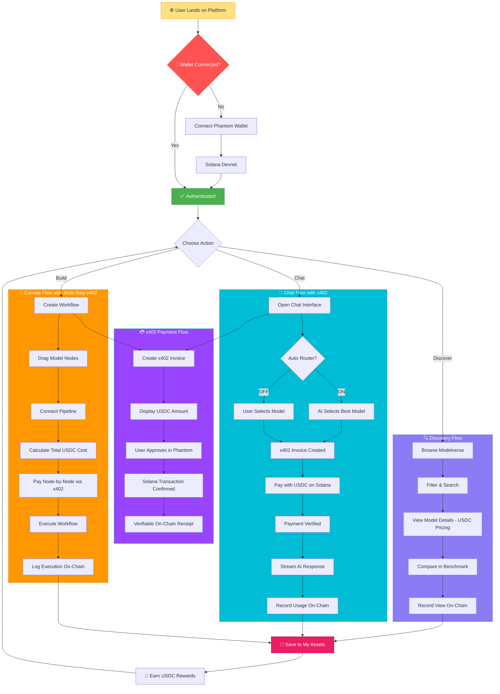
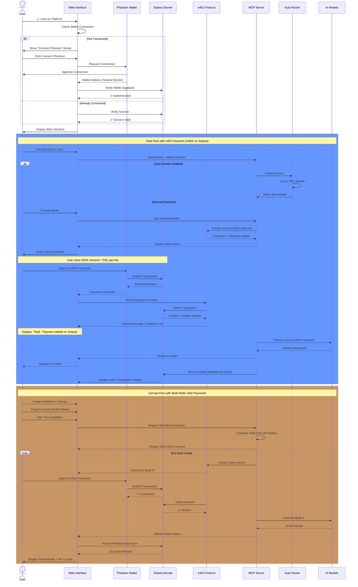
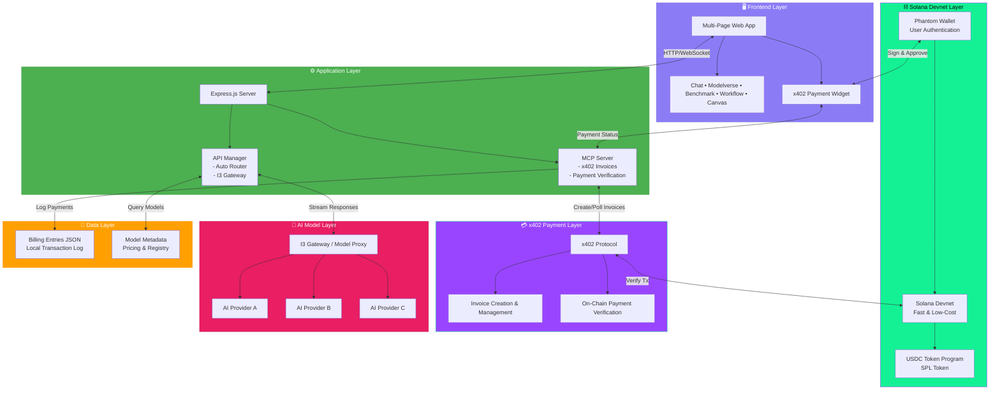
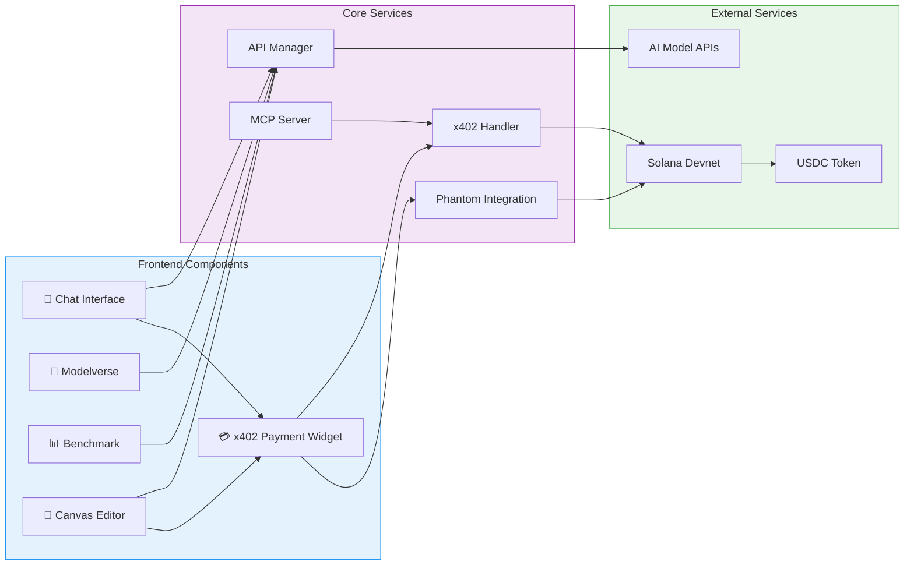
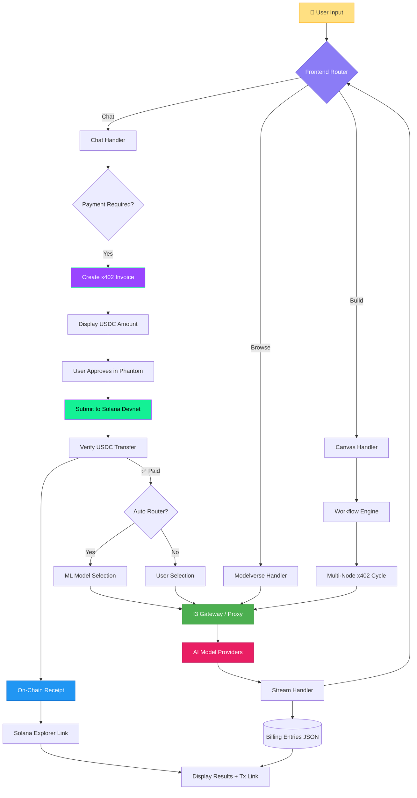

# Intelligence Cubed (i³) – x402 Edition

<div align="center">


**A Decentralized AI Marketplace with x402 Payments**

Where AI models are both **Model-as-a-Service (MaaS)** and **liquid, revenue-sharing assets**. Discover, compare, and compose models in a visual Canvas with transparent **USDC pricing** and **on-chain x402 payments** on **Solana Devnet**.

[](https://opensource.org/licenses/MIT)
[](https://nodejs.org/)
[](https://solana.com/)
[](https://solana.com/)
[](https://www.circle.com/usdc)

[Litepaper](http://intelligencecubed.com/) | [Twitter](https://x.com/I3_Cubed) | [Telegram](https://t.me/I3_Cubed)

</div>

---

## 🏆 Hackathon Submission

**Hackathon:** Solana x402 Hackathon – **Best x402 Agent Application**  
**Status:** Fully working prototype with on-chain x402 payments, model marketplace, benchmarks, workflows, and Canvas editor  
**Demo Video (≤ 3 min):** <https://www.youtube.com/watch?v=aUPYiAM4obg>

### 🚀 What Makes This Special

- ✅ **x402 Payment Protocol** – Every AI model call is paid via x402 invoices
- ✅ **Solana Devnet Integration** – Fast, low-cost on-chain payment settlement
- ✅ **USDC-Based Pricing** – Transparent, stablecoin-denominated pricing for all models
- ✅ **Phantom Wallet Integration** – Seamless payment experience for users
- ✅ **Verifiable On-Chain Receipts** – Every transaction is traceable on Solana Explorer

---

## 📚 Table of Contents
1. [Hackathon Submission](#-hackathon-submission)
2. [Overview](#1-overview)
3. [What the Product *Is*](#2-what-the-product-is)
4. [Problem & Solution](#3-problem--solution)
5. [Core Concepts](#4-core-concepts)
6. [Key Features](#3️⃣-key-features)
   - [Multi-Page AI Hub](#multi-page-ai-hub)
   - [x402 & On-chain Payments](#x402--on-chain-payments)
7. [How x402 & Solana Payments Work](#4️⃣-how-x402--solana-payments-work)
   - [A) Single-Model Chat Flow](#a-single-model-chat-flow)
   - [B) Modelverse / Benchmark "Try" Flow](#b-modelverse--benchmark-try-flow)
   - [C) Workflow & Canvas Flow](#c-workflow--canvas-flow)
8. [User Journey](#5️⃣-user-journey)
   - [Core User Flows](#core-user-flows-x402-payment-first-approach)
   - [Detailed User Journey](#detailed-user-journey-with-x402-payments)
9. [Architecture & Tech Stack](#6️⃣-architecture--tech-stack)
   - [High-Level System Architecture](#high-level-system-architecture)
   - [Component Architecture](#component-architecture)
   - [Data Flow Architecture](#data-flow-architecture-with-x402-payments)
   - [Architecture Components](#architecture-components)
10. [Technology Stack](#7️⃣-technology-stack)
11. [Getting Started](#8️⃣-getting-started)
    - [Prerequisites](#prerequisites)
    - [Clone & Install](#clone--install)
    - [Environment Variables](#environment-variables)
12. [Local Development](#9️⃣-local-development)
    - [Frontend (Vite dev server)](#frontend-vite-dev-server)
    - [Backend / MCP server](#backend--mcp-server)
    - [Production Build](#production-build)
13. [Roadmap](#-roadmap)
14. [License](#-license)

---
# Intelligence Cubed (i³)

> A decentralized **Modelverse** — think **Hugging Face × Uniswap** — where models are both **Model-as-a-Service (MaaS)** and **liquid, revenue-sharing assets**. Discover, compare, and compose models in a visual Canvas; pay per call with transparent USDC pricing; and get verifiable on-chain receipts via **x402**.

---

## 1) Overview

**Intelligence Cubed (i³)** is a decentralized modelverse that lets users:

- Discover curated AI models with transparent **USDC** pricing  
- Benchmark and compare models with community-driven **Proof of Intelligence**  
- Build and run multi-step workflows in a **Canvas** editor  
- Chat with any model or workflow via a unified **Chats** interface

Every paid action (single model call or workflow run) is **gated by x402 invoices** and settled in **USDC on Solana Devnet** via **Phantom**. Only **after** on-chain payment confirmation does the app invoke the underlying model(s) and stream back the answer.

---

## 2) What the Product *Is*

i³ is four layers that work together:

1. **Model-as-a-Service (MaaS)**  
   Call models directly via chat/API, chain them into workflows, and enable fine-tuning and secondary creation.

2. **Model as a Liquid Asset**  
   Tokenize models through **IMO (Initial Model Offering)** so ownership and usage revenues are shared transparently.

3. **Co-Creation (Canvas)**  
   Drag-and-drop to compose multi-step pipelines; derivative models automatically return royalties to ancestors.

4. **Democratic Benchmark (Proof of Intelligence)**  
   Usage-driven rankings and indices so the best models rise on merit, not just lab tests.

> **Open-source threshold:** when **>51%** of a model’s ownership is publicly held, the model transitions to open source to accelerate adoption and remixing.

---

## 3) Problem & Solution

### Problems
- **Model discovery gap:** Lists are long, quality varies, pricing is opaque, and router logic is often a black box.  
- **Payment gap:** Most AI apps are centralized, credit- or subscription-based. There’s no standard way for third-party agents to **programmatically** pay per call and obtain **verifiable on-chain receipts**.

### Our Solution
- **Modelverse + Benchmark + Workflows + Canvas** for one-stop **discover → compare → compose**.  
- **Tokenized ownership & royalties** (IMO + derivative revenue share) for sustainable creator incentives.  
- **Unified x402 payment layer**: each call is invoiced, paid, verified on-chain, then executed.

---

## 4) Core Concepts

- **IMO (Initial Model Offering):** Creators mint model ownership, fund development, and share future usage revenues.  
- **Royalties Accumulation:** Derivative models automatically pay upstream royalties across the lineage.  
- **Proof of Intelligence:** Continuous, usage-driven scoring and vertical indices (quality, usage, momentum).  
- **Democratic Pricing:** Stablecoin-anchored pricing that reflects demand and capacity, not arbitrary fees.

---


## 3️⃣ Key Features

### Multi-Page AI Hub

* **Chats (`index.html`)**  
  Single-model or Auto Router chat interface with a central input box:

  * “Ask AI anything…” prompt
  * **Auto Router** toggle: when enabled, the system scores hundreds of models and picks the best suited one for the user’s query.

* **Modelverse (`modelverse.html`)**  
  Model marketplace with:

  * Name, category, industry
  * **Price / API call (USDC)**
  * Usage, compatibility, total score
  * Actions: **Try** (jump into Chats) & **Add to Cart**

* **Benchmark (`benchmark.html`)**  
  Model benchmark leaderboard showing:

  * Performance scores
  * Usage metrics
  * Price & market stats
  * One-click “Try” into Chats.

* **Workflows (`workflow.html`)**  
  Workflow leaderboard:

  * Each card shows **Compute Cost**, **Estimated Gas**, and **Total (x402)** in USDC.
  * Actions: **Details**, **Pay with x402**.

* **Canvas (`canvas.html`)**  
  Visual workflow editor:

  * Drag-and-drop nodes (models)
  * Connect them into multi-step pipelines
  * Click **Run** to execute the pipeline, paying node-by-node through x402.

### x402 & On-chain Payments

* **402 Payment Progress widget** in the bottom-right shows:

  * Invoice status (Pending → Paid / Cancelled)
  * Amount, memo, and Solana tx link.
* **Phantom (Solana Devnet)** integration:

  * Users log in and confirm each payment.
  * Every payment is visible on **Solana Explorer**.

---

## 4️⃣ How x402 & Solana Payments Work

### A. Single-Model Chat Flow

1. User opens **Chats** (`index.html`), selects a model (or enables Auto Router), and sends a question, e.g. `“What does this do?”`.
2. The frontend sends the request to the MCP server; the server:

   * Calculates the model price in USDC.
   * Creates a **x402 payment** describing the required payment.
3. The UI shows a **x402 Payment Progress** card and prompts the user to **connect Phantom (Solana Devnet)**.
4. Phantom pops up:

   * User enters password (if locked) and approves the USDC transfer (plus small SOL network fee).
5. Once the transaction is confirmed:

   * The 402 card shows **Paid – Payment settled on Solana**, including:

     * Amount (USDC)
     * Memo (invoice ID)
     * `Tx` link to **Solana Explorer**.
6. Only then does the MCP server forward the prompt to the selected model and stream the answer back into the chat.

### B. Modelverse / Benchmark “Try” Flow

1. User visits **Modelverse** or **Benchmark** and clicks **Try** next to a model.
2. They are redirected to **Chats** with that model pre-selected.
3. They ask a question; the **same x402 flow** (invoice → Phantom → Explorer → answer) runs automatically.

### C. Workflow & Canvas Flow

1. User opens **Workflows** and chooses a workflow card (e.g. “AI Safety & Watermarking Pipeline”), then clicks **Pay with x402**.
2. The app opens **Canvas**, pre-loading the workflow graph.
3. User optionally edits the graph and clicks **Run**.
4. Backend:

   * Calculates the required price for the first node and returns a 402.
   * After payment, verifies the Solana transfer and executes that node.
   * Repeats the 402/payment cycle for each remaining node until the workflow completes.
5. Final results surface back through the **Chats** interface.

---

## 5️⃣ User Journey

### Core User Flows (x402 Payment-First Approach)



### Detailed User Journey with x402 Payments



---

## 6️⃣ Architecture & Tech Stack

### High-Level System Architecture



### Component Architecture



### Data Flow Architecture with x402 Payments



### Architecture Components

#### 1. **Frontend Layer** (HTML/CSS/JavaScript + Vite)
- Multi-page application with distinct interfaces
- **x402 Payment Progress Widget** for real-time payment status
- Phantom wallet integration for Solana Devnet
- Real-time streaming responses from AI models
- Responsive design with modern UI/UX

#### 2. **Application Layer** (Node.js/Express)
- RESTful API endpoints (`/api/*`)
- **MCP Server routes** (`/mcp/*`) for x402 payment handling
- Model selection and routing logic (Auto Router)
- Session and state management
- I3 Gateway for model orchestration

#### 3. **Blockchain Layer - Solana Devnet**
- **Solana Devnet**: Fast, low-cost blockchain for testing
- **USDC Token**: SPL Token standard for stablecoin payments
- **Phantom Wallet**: User authentication and payment approval
- **On-Chain Verification**: Every payment is verifiable on Solana Explorer
- **Transaction Receipts**: Immutable proof of payment

#### 4. **x402 Payment Layer**
- **Invoice Creation**: Generate payment requests with USDC amounts
- **Payment Polling**: Real-time status updates (Pending → Paid → Verified)
- **On-Chain Verification**: Confirm USDC transfers on Solana
- **Receipt Generation**: Provide Solana Explorer links for each transaction
- **Billing Logs**: Local JSON logging for reconciliation

#### 5. **AI Model Layer**
- Multiple AI model providers
- I3 Gateway for unified model access
- Response streaming for real-time interactions
- Usage tracking and analytics
- Pay-per-call execution model

#### 6. **Data Layer**
- **Model Registry**: Metadata, pricing, and capability information
- **Billing Entries**: `data/billing-entries.json` for transaction logs
- **User Profiles**: Wallet-based identity and transaction history

### Data Flow Summary

1. **User Action** → Frontend captures intent (chat query, workflow execution)
2. **x402 Invoice** → Create payment request with USDC amount
3. **Phantom Approval** → User approves USDC transfer on Solana Devnet
4. **Payment Verification** → Confirm on-chain transaction
5. **Model Selection** → Auto Router or user selects appropriate model(s)
6. **API Request** → Forward to I3 Gateway after payment confirmation
7. **Model Execution** → Execute AI model and stream response
8. **On-Chain Receipt** → Generate verifiable Solana Explorer link
9. **Billing Log** → Record transaction in local JSON for reconciliation

---

## 7️⃣ Technology Stack

### Frontend
- **HTML5/CSS3**: Modern web standards
- **JavaScript (ES6+)**: Client-side logic
- **Vite**: Build tool and dev server
- **Phantom Wallet SDK**: Solana wallet integration

### Backend
- **Node.js (≥18)**: Runtime environment
- **Express.js**: Web framework
- **CORS**: Cross-origin resource sharing
- **I3 Gateway**: Unified API gateway for AI models

### Blockchain & Payments
- **Solana Devnet**: Fast, low-cost blockchain network
- **@solana/web3.js**: Solana JavaScript SDK
- **@solana/spl-token**: SPL Token library for USDC
- **x402 Protocol**: Payment invoice standard
- **Phantom Wallet**: User authentication and payments

### Data & Storage
- **JSON File System**: Local billing logs (`data/billing-entries.json`)
- **Model Registry**: Metadata and pricing database

### AI/ML
- **Auto Router**: Intelligent model selection system
- **I3 API**: Standardized interface for all models
- **Streaming Responses**: Real-time text generation

---

## 8️⃣ Getting Started

### Prerequisites

* **Node.js** ≥ 18
* **npm** ≥ 8 (or `yarn`)
* **Phantom** wallet installed in your browser, set to **Solana Devnet**
* Optional but recommended: some DEVNET SOL & USDC in Phantom for testing.

### Clone & Install

```bash
git clone <TODO: repository-url>
cd x402_i3_app
npm install
# or
yarn install
```

### Environment Variables

You can export these in your shell or use a `.env` file (with `dotenv` wired into `serve.js`):

* **Server basics**

  * `PORT` – default `3000` (often mapped to `8080` in production)
  * `HOST` – default `127.0.0.1` (use `0.0.0.0` to listen on all interfaces)
  * `NODE_ENV` – `development` or `production`

* **Model proxy**

  * `I3_PROXY_BASE` – base URL of the proxy (e.g. `http://localhost:8000`)

* **x402 / Solana settings** (can also live in `server/mcp/config.js`)

  * `X402_NETWORK` – e.g. `solana-devnet`
  * `X402_MINT` – USDC mint address on Devnet
  * `X402_RECIPIENT` – your merchant/agent wallet address
  * `X402_PAYMENT_URL` – optional x402 facilitator endpoint
  * `X402_EXPLORER_URL` – Solana Explorer base URL
  * `X402_RPC_URL` – Solana RPC endpoint
  * `X402_DECIMALS` – token decimals (usually `6` for USDC)
  * `X402_EXPIRES_SECONDS` – invoice expiry duration in seconds

Ensure that `data/billing-entries.json` exists, is writable, and follows `{ "entries": [] }`. The repo ships with a sample file; replace it with an empty structure if you need a clean slate.

---

## 9️⃣ Local Development

### Frontend (Vite dev server)

```bash
npm run dev
# or
yarn dev
```

* Default: `http://localhost:3000`
* Hot reload enabled.
* `vite.config.js` is configured with `host: '0.0.0.0'` so you can access it from other devices on your LAN.

### Backend / MCP server

In a separate terminal:

```bash
npm start
# or
yarn start
```

This launches `serve.js`, which:

* Serves static files (for production build)
* Exposes `/api/*` and `/mcp/*` routes
* Handles 402 invoice creation, polling, and post-payment model calls

### Production Build

```bash
npm run build
npm run preview     # optional local preview of the built assets
```

In production, you typically:

1. `npm run build`
2. `npm start` (or `node serve.js`) behind a reverse proxy.

---

## 🔮 Roadmap

* **Mainnet-beta deployment** with production-grade RPC and observability.
* **Model provider onboarding**:

  * Let external developers list models/workflows with their own x402 pricing and recipient addresses.
* **More wallets & platforms**:

  * Support additional Solana wallets and mobile-first flows.
* **Agent API**:

  * Document and expose MCP endpoints so external AI agents can programmatically:

    * Discover models
    * Quote prices
    * Pay with x402
    * Invoke models and workflows

---

## 🧾 License

This project is licensed under the **MIT License** – see the [`LICENSE`](./LICENSE) file for details.

